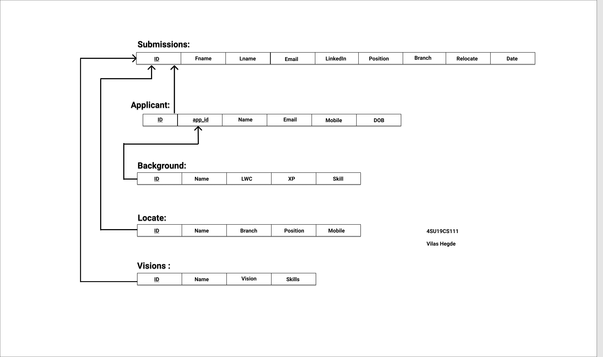

# Job Application Management System - DBMS Mini Project
> A website to apply job application to some company

## Tools used
- XAMPP
- PHP
- MySQL
- Javascript
- HTML
- CSS
- Bootsrap

## Features for applicant
1. Easy way to enter the data for the user
2. All type input handling for data consistency
3. Uploading photo as well as personal data safely
4. View status of application option for an applicant 
5. Solve Riddles on the same website
6. Giving feedback
7. Edit option after submission (not all field)

## Features for admin
1. Secure login using session
2. Viewing all the records all at once
3. Filtering records based on date, position etc
4. Searching any particular form of data
5. Edit and Delete exclusive option
6. Setting up the required spot to know the number of opening for further analysis
7. Beautiful graphs, charts, bar diagrams to easily visualise the data in real time
8. Viewing data in individual tables
9. ER and Schema representation and implementation to accomplish relational database system
10. Get today's submissions only
11. Add riddles to database

## Schema diagram

## Entity Relationship diagram
.png)
